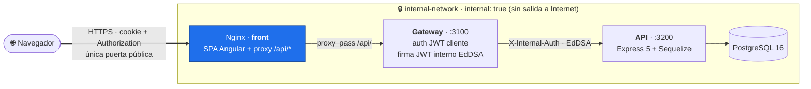

# 🚀 Nx Fullstack Starter

> **Un starter completo y profesional para monorepos TypeScript con Angular 21 + Express.js + PostgreSQL, con backend partido en microservicios (gateway + api) y rotación de refresh con detección de reuso.**

[](https://opensource.org/licenses/MIT)
[](https://nodejs.org/)
[](https://angular.io/)
[](https://nx.dev/)
[](https://expressjs.com/)

🌐 [English version](docs/README_eng.md)

Monorepo Nx listo para producción que incluye autenticación JWT con rotación de refresh, gateway de seguridad con EdDSA, gestión de usuarios, sistema de permisos basado en roles, internacionalización y Docker. Pensado para arrancar proyectos SaaS y multi-servicio sin tener que rehacer la capa de auth.

## ✨ Características Principales

### 🎯 **Stack Tecnológico**

- **Frontend**: Angular 21 con standalone components, Signals API y control flow nativo (`@if` / `@for` / `@switch`)
- **Nginx (front)**: sirve la SPA y es la puerta pública; hace reverse-proxy de `/api/*` al gateway (mismo origen)
- **Gateway**: Express 5 + `http-proxy-middleware` — privado (`internal-network`), detrás de nginx; gestiona tokens y CORS
- **API**: Express 5 + Sequelize, privado (`internal-network`), expone CRUDs y endpoints `/internal/*` para el gateway
- **Base de datos**: PostgreSQL 16
- **Monorepo**: Nx 22 para gestión eficiente
- **Build System**: esbuild (backend) + Vite (frontend)
- **Containerización**: Docker + Docker Compose; sólo `front` (nginx) se expone, el resto vive en `internal-network` (`internal: true`)
- **UI**: Bootstrap 5 + NgBootstrap
- **i18n**: Transloco (Español/Valenciano/Inglés)

### 🔐 **Autenticación & Seguridad** — ver [`docs/SECURITY.md`](docs/SECURITY.md)

- Arquitectura de microservicios: **nginx** (front) como puerta pública → **gateway** (auth) → **api** privado. El api nunca habla con el cliente directamente; el gateway firma un JWT interno EdDSA antes de proxiar
- JWT del cliente con **dos secretos separados** (`JWT_ACCESS_SECRET`, `JWT_REFRESH_SECRET`), claims `typ` y `jti`
- **Rotación de refresh con detección de reuso**: tabla `refresh_token_family` revoca la familia completa si una cookie ya rotada se vuelve a presentar
- **JWT interno Ed25519** entre gateway y api: el gateway tiene la clave privada (firma), el api sólo la pública (verifica). Privilegio separado: un api comprometido no puede emitir tokens
- Sistema de permisos basado en roles (`ADMIN`, `WRITE_SOME_ENTITY`, `READ_SOME_ENTITY`), guards Angular y middleware `requireInternalAuth` por scope
- Interceptores HTTP automáticos
- Hashing seguro de contraseñas con bcrypt

> **Antes del primer arranque** generá las claves Ed25519 y los secretos JWT siguiendo [docs/SECURITY.md](docs/SECURITY.md).

### 🌍 **Internacionalización**

- Soporte completo para múltiples idiomas
- Cambio dinámico de idioma
- Persistencia de preferencias
- Traducciones completas de la UI

### 🏗️ **Arquitectura**



- **Nginx (contenedor `front`)** es la **única puerta pública**: sirve la SPA y hace reverse-proxy de `/api/*` al gateway (mismo origen → las cookies viajan sin CORS). El navegador nunca habla con el gateway directamente.
- **Gateway**, **API** y **PostgreSQL** viven todos en `internal-network` (`internal: true`), sin entrada desde Internet. El gateway autentica el JWT del cliente, firma el JWT interno EdDSA y proxia al api privado.
- Patrón Controller-Service-Repository en el api
- DTOs compartidos entre frontend y backend en `libs/rest-dto`
- Contrato interno gateway↔api en `libs/internal-auth` (Ed25519 + scopes)
- Middleware de autenticación centralizado (`requireInternalAuth` por scope)
- Manejo de errores unificado (`HttpResponser`, `sequelizeErrorMiddleware`)
- Soft deletes en todas las entidades (`deleted`, `createdAt`, `updatedAt`, `deletedAt`)

## 🚀 Inicio Rápido

### Prerrequisitos

```bash
# Verificar versiones
node --version   # >= 22.12.0
npm --version    # >= 10.9.0
docker --version
docker compose version
```

### Instalación

```bash
# 1. Clonar el repositorio
git clone https://github.com/dherrero/fullstack-starter.git
cd fullstack-starter

# 2. Instalar dependencias
npm install

# 3. Configurar variables de entorno (incluye claves Ed25519 — ver docs/SECURITY.md)
cp .env.example .env
# Editar .env con tus configuraciones y claves generadas

# 4. Iniciar desarrollo
npm run dev
```

### Acceso a la Aplicación

- **Frontend**: http://localhost:4200
- **Gateway (API del cliente)**: http://localhost:3100/api/v1/ (en dev el front la consume vía proxy de Vite; en docker, tras nginx)
- **API (privado)**: http://localhost:3200 (sólo accesible vía gateway en docker)
- **Base de datos**: localhost:5432

### Usuario por Defecto

El esquema **no siembra ningún usuario**. Por seguridad no existen credenciales
por defecto. Para crear un administrador local en desarrollo, genera un hash y
habilita el seed (sólo dev):

```bash
# 1. Genera el hash bcrypt de tu contraseña
bash scripts/gen-admin-hash.sh 'tu-contraseña-fuerte'

# 2. En tu .env
DEV_SEED_ADMIN=true
BOOTSTRAP_ADMIN_EMAIL=admin@example.test
BOOTSTRAP_ADMIN_PASSWORD_HASH=<el hash generado>

# 3. Recrea la base de datos para que corra el seed
npm run dev:db:clean && npm run dev:db
```

> Nunca habilites `DEV_SEED_ADMIN` en producción.

## 🛠️ Comandos de Desarrollo

### Desarrollo Local

```bash
# Desarrollo completo (recomendado)
npm run dev              # DB + API + Gateway + Frontend en paralelo

# Desarrollo por pasos
npm run dev:db           # Sólo base de datos
npm run dev:api          # Sólo api (espera DB)
npm run dev:gateway      # Sólo gateway (espera api)
npm run dev:front        # Sólo frontend (espera gateway)

# Comandos individuales
npm run start:front      # Iniciar frontend
npm run start:api        # Iniciar api
npm run start:gateway    # Iniciar gateway
npm run start:all        # Iniciar los tres servicios
```

### Gestión de Base de Datos

```bash
npm run dev:db:down      # Detener base de datos
npm run dev:db:clean     # Limpiar volúmenes de DB
```

### Construcción y Despliegue

```bash
# Construcción
npm run build:front      # Construir frontend
npm run build:api        # Construir api
npm run build:gateway    # Construir gateway
npm run build            # Construir los tres

# Docker
npm run docker:up        # Levantar el stack completo
```

### Tests

```bash
npm run test                  # Todo (front excluido, usa su config)
npm run test:front            # Tests del front
npm run test:api              # Tests del api
npm run test:gateway          # Tests del gateway
npm run test:internal-auth    # Tests de la lib de auth interno
npm run test:coverage         # Cobertura
```

## 📁 Estructura del Proyecto

```
nx-fullstack-starter/
├── apps/
│   ├── front/                    # Aplicación Angular 21
│   │   ├── src/app/
│   │   │   ├── components/       # Componentes reutilizables
│   │   │   ├── pages/            # Páginas (home, login)
│   │   │   ├── libs/auth/        # Módulo de autenticación (service, guards)
│   │   │   └── services/         # Servicios de negocio
│   │   └── src/assets/i18n/      # Archivos de traducción
│   ├── gateway/                  # Servicio de auth + proxy, privado tras nginx (Express + http-proxy-middleware)
│   │   └── src/
│   │       ├── controllers/      # auth.controller (login/logout)
│   │       ├── middleware/       # hasPermission, refresh rotation
│   │       ├── services/         # tokenService (firma JWT cliente)
│   │       ├── clients/          # api.client (gateway → api)
│   │       └── routes/           # auth, health, proxy
│   └── api/                      # Servicio privado (Express + Sequelize)
│       └── src/
│           ├── controllers/      # internal-auth, refresh-lifecycle, user-crud
│           ├── services/         # AbstractCrudService, refresh-token-family
│           ├── models/           # Sequelize: User, RefreshTokenFamily
│           ├── routes/           # /internal/* + /v1/*
│           └── adapters/         # db, http
├── libs/
│   ├── rest-dto/                 # DTOs compartidos front ↔ back
│   └── internal-auth/            # JWT EdDSA + requireInternalAuth middleware
├── db/                           # Migraciones SQL (10.user, 20.refresh_token_family)
├── nginx/                        # Configuración Nginx (front en prod)
├── docs/                         # Documentación (SECURITY.md, etc.)
└── compose.yaml                  # Docker Compose con redes split
```

## 🤖 Claude Code Friendly — Sistema de Agentes

Este proyecto está configurado para trabajar de forma óptima con **Claude Code**, el agente de codificación de Anthropic. Incluye un sistema de agentes especializados que permite implementar funcionalidades completas de extremo a extremo de forma autónoma, respetando todas las convenciones del proyecto sin que sea necesario recordárselas.

### Estructura de configuración

```
.claude/
├── agents/                      # Subagentes especializados
│   ├── database-specialist.md   # Base de datos (PostgreSQL, migraciones, índices)
│   ├── backend-developer.md     # Backend (Express, Sequelize, servicios, JWT)
│   ├── frontend-developer.md    # Frontend — lógica (Angular, componentes, formularios)
│   ├── ux-ui-designer.md        # Frontend — diseño (UX/UI, accesibilidad, SEO, PWA)
│   └── qa-engineer.md           # Control de calidad (tests, linting, cobertura)
├── skills/                      # Skills invocables
│   ├── angular-developer.md     # Directrices oficiales de Angular (fuente Google)
│   ├── frontend-design/         # Estética + sistema de design tokens
│   ├── web-design-review/       # Auditoría a11y / SEO / UX (salida file:line)
│   └── angular-pwa-seo/         # PWA (manifest, service worker) + SEO
└── settings.local.json          # Permisos y lista de operaciones permitidas/denegadas
```

El fichero `AGENTS.md` de la raíz actúa como **orquestador principal**: recibe la petición, la descompone por capas y delega en cada subagente respetando el orden de dependencias. Cada paquete (`apps/*`, `libs/*`, `db`) tiene su propio `AGENTS.md` con las reglas específicas de esa capa; `CLAUDE.md` solo apunta a `AGENTS.md`.

### Flujo de orquestación

```
Petición del usuario
         ↓
  [AGENTS.md] Orquestador
         ↓
  ┌──────┬──────────┬─────────────────────────────┬──────┐
  ↓      ↓          ↓                             ↓      ↓
 DB   Backend   Frontend                          QA
                 ├─ ux-ui-designer (diseño)         │
                 ├─ frontend-developer (lógica)     │
                 └─ ux-ui-designer (review a11y/SEO) │
  ↓      ↓          ↓                             ↓      ↓
  └──────┴──────────┴─────────────────────────────┴──────┘
         ↓
  Informe por capa al usuario
```

El orden de ejecución respeta las dependencias: base de datos → backend → frontend → QA.
En la capa de frontend colaboran **dos** agentes sin pisarse: `ux-ui-designer` define el
diseño (tokens, accesibilidad, SEO, PWA), `frontend-developer` implementa la lógica, y el
diseñador cierra con un pase de revisión. El orquestador los secuencia para que nunca
editen el mismo fichero a la vez.

### Subagentes

#### 🗄️ Database Specialist

Especialista en diseño de esquemas PostgreSQL y MongoDB, migraciones sin downtime, indexación y optimización de consultas.

- Genera ficheros SQL numerados en `db/` (nunca auto-sync con Sequelize)
- Modelos Sequelize con mapeo `field` para columnas lowercase
- Soft deletes (`deleted`, `deletedAt`) en todas las entidades
- Estrategia de índices: FKs, compuestos, parciales y cubrientes
- Análisis de rendimiento con `EXPLAIN ANALYZE`

#### 🔧 Backend Developer

Especialista en Express + Sequelize siguiendo arquitectura de 4 capas: Routes → Controllers → Services → Models. Trabaja sobre `apps/api` (lógica de negocio) y `apps/gateway` (auth de cliente, proxy).

- Patrones `AbstractCrudService` / `AbstractCrudController` para minimizar boilerplate
- Todas las respuestas HTTP a través de `HttpResponser` (nunca `res.json()` directo)
- Las rutas del api se protegen con `requireInternalAuth({ allowedScopes, requiredPermissions })` de `libs/internal-auth`
- Las rutas del gateway se protegen con `hasPermission(Permission.X)` del middleware local
- Tests unitarios con Vitest, mocks sólo en los límites (DB, HTTP, fetch)

#### 🎨 Frontend Developer

Especialista en Angular siguiendo Clean Architecture y las últimas prácticas oficiales.

- Componentes standalone con `OnPush` y Signals API (`signal`, `computed`, `linkedSignal`, `resource`)
- `inject()` para inyección de dependencias — nunca constructor injection
- **Control flow nativo** (`@if`, `@for`, `@switch`) — sin `*ngIf` ni `*ngFor` en código nuevo
- Rutas lazy-loaded con `loadComponent()` / `loadChildren()`
- Signal Forms para nuevos formularios (Angular v21+)
- DTOs importados de `libs/rest-dto` (fuente única de verdad, nunca redefinidos)
- **Consume los design tokens** del diseñador — nunca hardcodea colores/espaciados

#### 🎨 UX/UI Designer

Especialista en la **capa de experiencia y presentación** del frontend. Colabora con el
`frontend-developer` sin solaparse: el diseñador define y revisa el look & feel, la
accesibilidad, el SEO y la PWA; el desarrollador implementa la lógica.

- **UX/UI y theming**: sistema de **design tokens** (light/dark) mapeados sobre las
  variables `--bs-*` de Bootstrap; layout responsive **mobile-first**; estados visuales
  (hover/focus/disabled/loading/empty/error)
- **Accesibilidad** (WCAG 2.2 AA): HTML semántico, ARIA, navegación por teclado,
  `:focus-visible`, contraste, `prefers-reduced-motion`
- **SEO**: `Title`/`Meta` por ruta, Open Graph/Twitter, canonical, JSON-LD, Core Web Vitals
- **PWA**: web app manifest, service worker (`@angular/service-worker`), offline e instalación
- **Carriles** (para no pisarse): edita estilos/tokens, `index.html`, manifest/`ngsw-config`,
  claves i18n y el markup de plantillas (semántica/ARIA/clases/`alt`); **no** toca lógica
  de componentes — cuando hace falta, entrega un _spec_ con contratos al desarrollador
- Stack real: **Bootstrap 5 + ng-bootstrap + Lineicons** (no Material ni Tailwind)
- Skills: `/frontend-design`, `/web-design-review`, `/angular-pwa-seo`

#### ✅ QA Engineer

Se ejecuta **siempre el último**, una vez que todos los agentes de implementación han terminado.

1. Compilación TypeScript sin errores (`npx nx run-many -t build`)
2. Linting (`npm run lint`)
3. Tests y cobertura — umbral mínimo del **60%** en ficheros nuevos
4. Revisión de calidad de tests (aserciones significativas, casos límite cubiertos)
5. Revisión de código (SRP, DRY, sin código muerto)
6. Checklist de convenciones por capa
7. Informe final: `PASS | PASS WITH WARNINGS | FAIL`

### Skills

| Skill               | Invocación           | Descripción                                                                                                              |
| ------------------- | -------------------- | ------------------------------------------------------------------------------------------------------------------------ |
| `angular-developer` | `/angular-developer` | Carga las directrices oficiales de Angular antes de escribir código. Se invoca automáticamente en el agente de frontend. |
| `frontend-design`   | `/frontend-design`   | Diseño estético + sistema de design tokens (light/dark), filosofías de diseño, mobile-first. Lo usa el `ux-ui-designer`. |
| `web-design-review` | `/web-design-review` | Auditoría de accesibilidad / SEO / UX con salida concisa `file:line`. Lo usa el `ux-ui-designer`.                        |
| `angular-pwa-seo`   | `/angular-pwa-seo`   | Configura/audita PWA (manifest, service worker) y SEO (meta, JSON-LD) en Angular. Lo usa el `ux-ui-designer`.            |

> **Gestión de tareas**: este starter no impone ningún gestor. Usa el que ya emplee tu equipo (Jira, Linear, GitHub Issues, etc.) o ninguno; la orquestación no lo requiere.

### Cómo usarlo

Abre Claude Code en la raíz del proyecto y describe en lenguaje natural la funcionalidad que quieres implementar. El orquestador delega en los subagentes correctos y entrega un informe por capas:

```
"Añade un módulo de gestión de productos con CRUD completo:
 tabla products con name, description, price y stock"
```

## 🎯 Tips de Trabajo

### 🔄 **Flujo de Desarrollo Recomendado**

1. **Configuración inicial**

   ```bash
   git clone https://github.com/dherrero/fullstack-starter.git
   cd fullstack-starter
   npm install
   cp .env.example .env
   # Generar claves Ed25519 — ver docs/SECURITY.md
   ```

2. **Desarrollo diario**

   ```bash
   # Terminal 1: Base de datos
   npm run dev:db

   # Terminal 2: API
   npm run dev:api

   # Terminal 3: Gateway
   npm run dev:gateway

   # Terminal 4: Frontend
   npm run dev:front
   ```

3. **Antes de commit**

   ```bash
   npm run lint
   npm run test
   npm run build
   ```

### 🏗️ **Arquitectura y Patrones**

#### **Frontend (Angular 21)**

- **Standalone Components** con `OnPush`
- **Control flow nativo** (`@if`, `@for`, `@switch`) — sin `*ngIf` ni `*ngFor` en código nuevo
- **Services**: lógica de negocio inyectada con `inject()`
- **Guards**: protección de rutas con `canActivateFn`
- **Interceptors**: manejo automático de autenticación
- **Reactive Forms**: formularios reactivos (Signal Forms a partir de v21+)

#### **Backend (Gateway + API)**

- **Gateway**: emite y verifica el JWT del cliente, inyecta `X-Internal-Auth` (EdDSA) en cada request proxiada
- **API**: cualquier ruta `/v1/*` o `/internal/*` se monta detrás de `requireInternalAuth` con el scope adecuado
- **DTOs**: tipados compartidos en `libs/rest-dto`
- **Error Handling**: middleware unificado de errores Sequelize + `HttpResponser`

### 🔧 **Mejores Prácticas**

#### **Git Workflow**

```bash
# Crear feature branch
git checkout -b feat/nueva-funcionalidad

# Desarrollo con commits frecuentes
git add .
git commit -m "feat: añadir nueva funcionalidad"

# Push y PR
git push origin feat/nueva-funcionalidad
```

#### **Estructura de Commits**

```
feat: nueva funcionalidad
fix: corrección de bug
docs: actualización de documentación
style: cambios de formato
refactor: refactorización de código
test: añadir o modificar tests
chore: tareas de mantenimiento
```

#### **Naming Conventions**

- **Archivos**: kebab-case (`user-service.ts`)
- **Clases**: PascalCase (`UserService`)
- **Variables**: camelCase (`userName`)
- **Constantes**: UPPER_SNAKE_CASE (`API_BASE_URL`)

### 🧪 **Testing**

```bash
# Por proyecto
npm run test:front
npm run test:api
npm run test:gateway
npm run test:internal-auth

# Tests e2e (cuando haya)
npm run e2e:front

# Coverage
npm run test:coverage
```

### 🐳 **Docker**

#### **Desarrollo**

```bash
# Sólo base de datos
docker compose -f docker-compose.db.yml up

# Stack completo
docker compose --env-file .env up
```

#### **Producción**

```bash
npm run build
docker compose --env-file .env up -d
```

> Sólo `front` (nginx) se expone al exterior. `gateway`, `api` y `postgresdb` viven en `internal-network` con `internal: true` y no son accesibles desde Internet.

### 🌍 **Internacionalización**

#### **Añadir nuevo idioma**

1. Crear archivo en `apps/front/src/assets/i18n/nuevo-idioma.json`
2. Actualizar `transloco-loader.service.ts`
3. Añadir opción en `language-switcher.component.ts`

#### **Usar traducciones**

```typescript
// En el componente
this.translocoService.translate('clave.traduccion');
```

```html
<!-- En el template -->
{{ 'clave.traduccion' | transloco }}
```

### 🔐 **Seguridad**

#### **Variables de Entorno**

```bash
# Nunca commitees archivos .env
echo ".env" >> .gitignore

# Usa .env.example como plantilla
cp .env.example .env
```

#### **Configuración JWT y claves internas**

```env
# JWT del cliente (HS256, dos secretos independientes)
JWT_ACCESS_SECRET=...        # firma access tokens
JWT_REFRESH_SECRET=...       # firma refresh tokens
JWT_EXPIRES_IN=4h
JWT_REFRESH_EXPIRES_IN=8h

# JWT interno gateway → api (Ed25519, asimétrico)
INTERNAL_JWT_PRIVATE_KEY=... # sólo en el gateway
INTERNAL_JWT_PUBLIC_KEY=...  # sólo en el api
```

Generación de claves en [`docs/SECURITY.md`](docs/SECURITY.md).

### 🚀 **Performance**

#### **Frontend**

- Lazy loading de rutas
- OnPush change detection
- `@for` con `track` (sustituye a `trackBy` de `*ngFor`)
- Preload strategies

#### **Backend**

- Connection pooling de Sequelize
- Query optimisation
- Caching strategies
- Compression middleware

## 🗄️ Base de Datos

### Esquema de Usuarios

```sql
CREATE TABLE public.user (
    id bigint PRIMARY KEY,
    email varchar(150) UNIQUE NOT NULL,
    name varchar(150) NOT NULL,
    lastname varchar(150),
    permissions permission_type[] NOT NULL DEFAULT ARRAY['READ_SOME_ENTITY']::permission_type[],
    password varchar(250) NOT NULL,
    deleted boolean DEFAULT false,
    createdAt timestamp DEFAULT CURRENT_TIMESTAMP NOT NULL,
    updatedAt timestamp,
    deletedAt timestamp
);
```

### Esquema de Refresh Token Family (rotación + reuso)

```sql
CREATE TABLE public.refresh_token_family (
    id bigserial PRIMARY KEY,
    user_id bigint NOT NULL REFERENCES public.user(id) ON DELETE CASCADE,
    family_id uuid NOT NULL,
    jti uuid NOT NULL UNIQUE,
    parent_jti uuid,
    used boolean NOT NULL DEFAULT false,
    revoked_at timestamp,
    createdAt timestamp NOT NULL DEFAULT CURRENT_TIMESTAMP,
    updatedAt timestamp
);
```

Ver detalles del flujo en [`docs/SECURITY.md`](docs/SECURITY.md).

### Permisos Disponibles

- `ADMIN`: Acceso completo al sistema
- `WRITE_SOME_ENTITY`: Ejemplo de permiso de escritura
- `READ_SOME_ENTITY`: Ejemplo de permiso de lectura

## 🔧 Configuración Avanzada

### Variables de Entorno (`.env`)

```env
# Database
POSTGRESDB_HOST=localhost
POSTGRESDB_PORT=5432
POSTGRESDB_DATABASE=your_db_name
POSTGRESDB_USER=postgres
POSTGRESDB_PASSWORD=password

# JWT del cliente — dos secretos distintos
JWT_ACCESS_SECRET=dev-access-secret-replace-me
JWT_REFRESH_SECRET=dev-refresh-secret-replace-me
JWT_EXPIRES_IN=4h
JWT_REFRESH_EXPIRES_IN=8h

# JWT interno Ed25519 (PEM con \n literales)
INTERNAL_JWT_PRIVATE_KEY=
INTERNAL_JWT_PUBLIC_KEY=

# Gateway
GATEWAY_PORT=3100
API_BASE_URL=http://api:3200
CORS_ORIGIN=http://localhost:4200

# API
NODE_PORT=3200
NODE_ENV=development
NODE_PRODUCTION=false
HASH_SALT_ROUNDS=10
```

### Frontend (`environment.ts`)

```typescript
export const env = {
  production: false,
  // Path relativa para que el proxy del dev server (Vite) la redirija al gateway
  api: '/api/v1/',
};
```

## 📦 Despliegue

### Producción con Docker

```bash
# 1. Generar claves Ed25519 y secretos (docs/SECURITY.md)
# 2. Volcar al .env de producción
# 3. Levantar el stack
docker compose --env-file .env up -d --build
```

### Variables de Entorno de Producción

```env
NODE_ENV=production
NODE_PRODUCTION=true
POSTGRESDB_HOST=postgresdb
POSTGRESDB_DATABASE=production_db

# Generados con: openssl rand -base64 64
JWT_ACCESS_SECRET=...
JWT_REFRESH_SECRET=...

# Generados con: openssl genpkey -algorithm ed25519 ...
INTERNAL_JWT_PRIVATE_KEY=...   # sólo gateway
INTERNAL_JWT_PUBLIC_KEY=...    # sólo api

CORS_ORIGIN=https://tu-dominio.com
SERVICE_FQDN_GATEWAY=tu-dominio.com
SERVICE_FQDN_FRONT=app.tu-dominio.com
```

## 🤝 Contribución

1. Fork el proyecto
2. Crea una rama para tu feature (`git checkout -b feat/AmazingFeature`)
3. Commit tus cambios (`git commit -m 'feat: Add some AmazingFeature'`)
4. Push a la rama (`git push origin feat/AmazingFeature`)
5. Abre un Pull Request

### Guía de Contribución

- Sigue las convenciones de código existentes
- Añade tests para nuevas funcionalidades (cobertura mínima 60%)
- Actualiza la documentación si es necesario
- Usa commits descriptivos siguiendo Conventional Commits
- Si tocás auth/tokens, lee [`docs/SECURITY.md`](docs/SECURITY.md) antes

## 📄 Licencia

Este proyecto está bajo la Licencia MIT. Ver el archivo `LICENSE` para más detalles.

## 🆘 Soporte

### Documentación

- [Angular Docs](https://angular.io/docs)
- [Express.js Docs](https://expressjs.com/)
- [Nx Docs](https://nx.dev/)
- [Sequelize Docs](https://sequelize.org/)
- [`jose` (JWT EdDSA)](https://github.com/panva/jose)
- [`http-proxy-middleware`](https://github.com/chimurai/http-proxy-middleware)

### Comunidad

- [GitHub Issues](https://github.com/dherrero/fullstack-starter/issues)
- [Discussions](https://github.com/dherrero/fullstack-starter/discussions)

### Problemas Comunes

#### Error de conexión a la base de datos

```bash
docker ps                # verificar que Docker está corriendo
npm run dev:db:down
npm run dev:db
```

#### Error de puerto en uso

```bash
# Gateway (3100)
lsof -ti:3100 | xargs kill

# API (3200)
lsof -ti:3200 | xargs kill

# Front (4200)
lsof -ti:4200 | xargs kill
```

#### Login devuelve 500 con `relation "refresh_token_family" does not exist`

La migración `db/20.refresh_token_family.sql` no se aplicó. En desarrollo:

```bash
npm run dev:db:clean   # borra el volumen — recrea con migraciones
npm run dev:db
```

En producción, aplicar el SQL manualmente sobre la DB.

## 🎯 Próximos Pasos

### Personalización del Starter

1. **Renombrar el proyecto**: `bash scripts/rename.sh mi-saas`
2. **Cambiar el branding**: textos en `apps/front/src/assets/i18n/`, colores en `styles.scss`, favicon, logo
3. **Añadir nuevas entidades**: tabla SQL en `db/`, modelo Sequelize en `apps/api/src/models/`, servicio que extiende `AbstractCrudService`, controlador que extiende `AbstractCrudController`, ruta en `apps/api/src/routes/` protegida por `requireInternalAuth`, DTO en `libs/rest-dto`
4. **Añadir nuevos micros**: copiar el patrón de `apps/api` y declarar la ruta en el proxy del `apps/gateway`

### Roadmap

- [x] SSO/OIDC en el gateway para clientes enterprise (Okta, Azure AD, Auth0) — ver [docs/SECURITY.md → Federación OIDC](docs/SECURITY.md#federación-oidc-sso-okta--azure-ad--auth0)
- [ ] SAML para tenants legacy
- [ ] SCIM 2.0 para aprovisionamiento masivo
- [ ] Multi-tenancy en CRUDs
- [ ] Tests e2e completos (Playwright)
- [ ] Métricas y observabilidad (OpenTelemetry)

---

## 🌟 ¿Te gusta este proyecto?

¡Dale una ⭐ en GitHub y compártelo con la comunidad!

**¡Disfruta construyendo tu próxima aplicación! 🚀**

---

<div align="center">
  <p>Hecho con ❤️ por la comunidad</p>
  <p>
    <a href="https://angular.io/">Angular</a> •
    <a href="https://expressjs.com/">Express</a> •
    <a href="https://nx.dev/">Nx</a> •
    <a href="https://www.postgresql.org/">PostgreSQL</a>
  </p>
</div>
