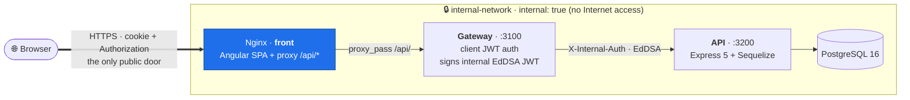

# 🚀 Nx Fullstack Starter

> **A complete, professional starter for TypeScript monorepos with Angular 21 + Express.js + PostgreSQL, with the backend split into microservices (gateway + api) and refresh-token rotation with reuse detection.**

[](https://opensource.org/licenses/MIT)
[](https://nodejs.org/)
[](https://angular.io/)
[](https://nx.dev/)
[](https://expressjs.com/)

🌐 [Versión en español](../README.md)

Production-ready Nx monorepo including JWT authentication with refresh rotation, security gateway with EdDSA, user management, role-based permissions, internationalisation, and Docker. Built so SaaS and multi-service projects can start without rebuilding the auth layer from scratch.

## ✨ Main Features

### 🎯 **Tech Stack**

- **Frontend**: Angular 21 with standalone components, Signals API and native control flow (`@if` / `@for` / `@switch`)
- **Nginx (front)**: serves the SPA and is the public door; reverse-proxies `/api/*` to the gateway (same origin)
- **Gateway**: Express 5 + `http-proxy-middleware` — private (`internal-network`), behind nginx; handles tokens and CORS
- **API**: Express 5 + Sequelize, private (`internal-network`), exposes CRUDs and `/internal/*` endpoints used by the gateway
- **Database**: PostgreSQL 16
- **Monorepo**: Nx 22 for efficient management
- **Build System**: esbuild (backend) + Vite (frontend)
- **Containerisation**: Docker + Docker Compose; only `front` (nginx) is exposed, everything else lives on `internal-network` (`internal: true`)
- **UI**: Bootstrap 5 + NgBootstrap
- **i18n**: Transloco (Spanish / Valencian / English)

### 🔐 **Authentication & Security** — see [`SECURITY.md`](SECURITY.md)

- Microservices architecture: **nginx** (front) as the public door → **gateway** (auth) → private **api**. The api never talks directly to clients; the gateway signs a short-lived EdDSA internal JWT before proxying.
- Client JWTs with **two separate secrets** (`JWT_ACCESS_SECRET`, `JWT_REFRESH_SECRET`), plus `typ` and `jti` claims.
- **Refresh rotation with reuse detection**: the `refresh_token_family` table revokes the whole family when an already-rotated cookie is replayed.
- **Internal Ed25519 JWT** between gateway and api: the gateway holds the private key (signs), the api only the public key (verifies). Privilege separation: a compromised api cannot mint tokens.
- Role-based permissions (`ADMIN`, `WRITE_SOME_ENTITY`, `READ_SOME_ENTITY`), Angular guards and a `requireInternalAuth` middleware that enforces scope per route.
- Automatic HTTP interceptors.
- Secure password hashing with bcrypt.

> **Before first boot**, generate the Ed25519 keys and JWT secrets following [`SECURITY.md`](SECURITY.md).

### 🌍 **Internationalisation**

- Full multi-language support
- Dynamic language switching
- Preference persistence
- Complete UI translations

### 🏗️ **Architecture**



- **Nginx (the `front` container)** is the **only public door**: it serves the SPA and reverse-proxies `/api/*` to the gateway (same origin → cookies travel without CORS). The browser never talks to the gateway directly.
- **Gateway**, **API** and **PostgreSQL** all live on `internal-network` (`internal: true`), with no inbound from the Internet. The gateway authenticates the client JWT, signs the internal EdDSA JWT and proxies to the private api.
- Controller-Service-Repository pattern inside the api
- Shared DTOs between frontend and backend in `libs/rest-dto`
- Internal gateway↔api contract in `libs/internal-auth` (Ed25519 + scopes)
- Centralised authentication middleware (`requireInternalAuth` by scope)
- Unified error handling (`HttpResponser`, `sequelizeErrorMiddleware`)
- Soft deletes on every entity (`deleted`, `createdAt`, `updatedAt`, `deletedAt`)

## 🚀 Quick Start

### Prerequisites

```bash
node --version   # >= 22.12.0
npm --version    # >= 10.9.0
docker --version
docker compose version
```

### Installation

```bash
# 1. Clone the repository
git clone https://github.com/dherrero/fullstack-starter.git
cd fullstack-starter

# 2. Install dependencies
npm install

# 3. Configure environment variables (includes Ed25519 keys — see SECURITY.md)
cp .env.example .env
# Edit .env with your settings and the generated keys

# 4. Start development
npm run dev
```

### Application Access

- **Frontend**: http://localhost:4200
- **Gateway (client API)**: http://localhost:3100/api/v1/ (in dev the front consumes it via the Vite proxy; under docker, behind nginx)
- **API (private)**: http://localhost:3200 (only reachable via the gateway under docker)
- **Database**: localhost:5432

### Default Credentials

The schema **seeds no users**. For security there are no default credentials.
To create a local admin in development, generate a hash and enable the
(dev-only) seed:

```bash
# 1. Generate the bcrypt hash of your password
bash scripts/gen-admin-hash.sh 'your-strong-password'

# 2. In your .env
DEV_SEED_ADMIN=true
BOOTSTRAP_ADMIN_EMAIL=admin@example.test
BOOTSTRAP_ADMIN_PASSWORD_HASH=<the generated hash>

# 3. Recreate the database so the seed runs
npm run dev:db:clean && npm run dev:db
```

> Never enable `DEV_SEED_ADMIN` in production.

## 🛠️ Development Commands

### Local Development

```bash
# Full development (recommended)
npm run dev              # DB + API + Gateway + Frontend in parallel

# Step by step
npm run dev:db           # Database only
npm run dev:api          # API only (waits for DB)
npm run dev:gateway      # Gateway only (waits for API)
npm run dev:front        # Frontend only (waits for Gateway)

# Individual commands
npm run start:front      # Start frontend
npm run start:api        # Start api
npm run start:gateway    # Start gateway
npm run start:all        # Start all three services
```

### Database Management

```bash
npm run dev:db:down      # Stop database
npm run dev:db:clean     # Clean DB volumes
```

### Build & Deploy

```bash
# Build
npm run build:front      # Build frontend
npm run build:api        # Build api
npm run build:gateway    # Build gateway
npm run build            # Build all three

# Docker
npm run docker:up        # Bring up the full stack
```

### Tests

```bash
npm run test                  # Everything (front excluded — uses its own config)
npm run test:front            # Frontend tests
npm run test:api              # API tests
npm run test:gateway          # Gateway tests
npm run test:internal-auth    # Internal-auth lib tests
npm run test:coverage         # Coverage report
```

## 📁 Project Structure

```
nx-fullstack-starter/
├── apps/
│   ├── front/                    # Angular 21 application
│   │   ├── src/app/
│   │   │   ├── components/       # Reusable components
│   │   │   ├── pages/            # Pages (home, login)
│   │   │   ├── libs/auth/        # Authentication module (service, guards)
│   │   │   └── services/         # Business services
│   │   └── src/assets/i18n/      # Translation files
│   ├── gateway/                  # Auth + proxy service, private behind nginx (Express + http-proxy-middleware)
│   │   └── src/
│   │       ├── controllers/      # auth.controller (login/logout)
│   │       ├── middleware/       # hasPermission, refresh rotation
│   │       ├── services/         # tokenService (client JWT signing)
│   │       ├── clients/          # api.client (gateway → api)
│   │       └── routes/           # auth, health, proxy
│   └── api/                      # Private service (Express + Sequelize)
│       └── src/
│           ├── controllers/      # internal-auth, refresh-lifecycle, user-crud
│           ├── services/         # AbstractCrudService, refresh-token-family
│           ├── models/           # Sequelize: User, RefreshTokenFamily
│           ├── routes/           # /internal/* + /v1/*
│           └── adapters/         # db, http
├── libs/
│   ├── rest-dto/                 # Shared DTOs front ↔ back
│   └── internal-auth/            # EdDSA JWT + requireInternalAuth middleware
├── db/                           # SQL migrations (10.user, 20.refresh_token_family)
├── nginx/                        # Nginx configuration (front in prod)
├── docs/                         # Documentation (SECURITY.md, etc.)
└── compose.yaml                  # Docker Compose with split networks
```

## 🤖 Claude Code Friendly — Agent System

This project is configured to work optimally with **Claude Code**, Anthropic's coding agent. It includes a system of specialised subagents that can implement complete end-to-end features autonomously, following all project conventions without needing to be reminded.

### Configuration structure

```
.claude/
├── agents/                      # Specialised subagents
│   ├── database-specialist.md   # Database (PostgreSQL, migrations, indexes)
│   ├── backend-developer.md     # Backend (Express, Sequelize, services, JWT)
│   ├── frontend-developer.md    # Frontend (Angular, components, forms)
│   └── qa-engineer.md           # Quality assurance (tests, linting, coverage)
├── skills/                      # Invokable skills
│   └── angular-developer.md     # Official Angular guidelines (Google source)
└── settings.local.json          # Permissions and allowed/denied operations
```

The root `AGENTS.md` file acts as the **main orchestrator**: it receives the request, breaks it down by layer, and delegates to each subagent in dependency order. Each package (`apps/*`, `libs/*`, `db`) has its own `AGENTS.md` with rules specific to that layer; `CLAUDE.md` only points to `AGENTS.md`.

### Orchestration flow

```
User request
      ↓
[AGENTS.md] Orchestrator
      ↓
┌─────┬──────────┬──────────┐
↓     ↓          ↓          ↓
DB  Backend  Frontend      QA
↓     ↓          ↓          ↓
└─────┴──────────┴──────────┘
      ↓
Layer-by-layer report to user
```

Execution order respects dependencies: database → backend → frontend → QA.

### Subagents

#### 🗄️ Database Specialist

Expert in PostgreSQL and MongoDB schema design, zero-downtime migrations, indexing, and query optimisation.

- Generates numbered SQL files in `db/` (never Sequelize auto-sync)
- Sequelize models with `field` mapping for lowercase DB columns
- Soft deletes (`deleted`, `deletedAt`) on all entities
- Index strategy: FK indexes, composite, partial, and covering indexes
- Performance analysis with `EXPLAIN ANALYZE`

#### 🔧 Backend Developer

Expert in Express + Sequelize following a 4-layer architecture: Routes → Controllers → Services → Models. Works across `apps/api` (business logic) and `apps/gateway` (client auth, proxy).

- `AbstractCrudService` / `AbstractCrudController` patterns to minimise boilerplate
- All HTTP responses through `HttpResponser` (never bare `res.json()`)
- API routes are protected with `requireInternalAuth({ allowedScopes, requiredPermissions })` from `libs/internal-auth`
- Gateway routes are protected with `hasPermission(Permission.X)` from the local middleware
- Vitest unit tests with mocks only at the boundaries (DB, HTTP, fetch)

#### 🎨 Frontend Developer

Expert in Angular following Clean Architecture and the latest official best practices.

- Standalone components with `OnPush` and Signals API (`signal`, `computed`, `linkedSignal`, `resource`)
- `inject()` for dependency injection — never constructor injection
- **Native control flow** (`@if`, `@for`, `@switch`) — no `*ngIf` or `*ngFor` in new code
- Lazy-loaded routes with `loadComponent()` / `loadChildren()`
- Signal Forms for new forms (Angular v21+)
- DTOs imported from `libs/rest-dto` (single source of truth, never redefined locally)

#### ✅ QA Engineer

Always runs **last**, after all implementation agents have finished.

1. TypeScript compilation with no errors (`npx nx run-many -t build`)
2. Linting (`npm run lint`)
3. Tests and coverage — minimum threshold of **60%** for new files
4. Test quality review (meaningful assertions, edge cases covered)
5. Code quality review (SRP, DRY, no dead code)
6. Per-layer conventions checklist
7. Final report: `PASS | PASS WITH WARNINGS | FAIL`

### Skills

| Skill               | Invocation           | Description                                                                                             |
| ------------------- | -------------------- | ------------------------------------------------------------------------------------------------------- |
| `angular-developer` | `/angular-developer` | Loads the official Angular guidelines before writing code. Invoked automatically by the frontend agent. |

> **Task tracking**: this starter is not tied to any task manager. Use whatever your team already uses (Jira, Linear, GitHub Issues, etc.) or none; the orchestration does not require one.

### How to use it

Open Claude Code at the project root and describe in plain language the feature you want to implement. The orchestrator delegates to the correct subagents and delivers a layer-by-layer report:

```
"Add a product management module with full CRUD:
 products table with name, description, price and stock"
```

## 🎯 Development Tips

### 🔄 **Recommended Development Flow**

1. **Initial setup**

   ```bash
   git clone https://github.com/dherrero/fullstack-starter.git
   cd fullstack-starter
   npm install
   cp .env.example .env
   # Generate Ed25519 keys — see SECURITY.md
   ```

2. **Daily development**

   ```bash
   # Terminal 1: Database
   npm run dev:db

   # Terminal 2: API
   npm run dev:api

   # Terminal 3: Gateway
   npm run dev:gateway

   # Terminal 4: Frontend
   npm run dev:front
   ```

3. **Before committing**

   ```bash
   npm run lint
   npm run test
   npm run build
   ```

### 🏗️ **Architecture & Patterns**

#### **Frontend (Angular 21)**

- **Standalone Components** with `OnPush`
- **Native control flow** (`@if`, `@for`, `@switch`) — no `*ngIf` or `*ngFor` in new code
- **Services**: business logic injected with `inject()`
- **Guards**: route protection with `canActivateFn`
- **Interceptors**: automatic authentication handling
- **Reactive Forms**: reactive forms (Signal Forms from v21+)

#### **Backend (Gateway + API)**

- **Gateway**: issues and verifies the client JWT, injects `X-Internal-Auth` (EdDSA) on every proxied request
- **API**: every `/v1/*` or `/internal/*` route sits behind `requireInternalAuth` with the right scope
- **DTOs**: shared typed contracts in `libs/rest-dto`
- **Error Handling**: unified Sequelize error middleware + `HttpResponser`

### 🔧 **Best Practices**

#### **Git Workflow**

```bash
# Create feature branch
git checkout -b feat/new-feature

# Develop with frequent commits
git add .
git commit -m "feat: add new feature"

# Push and PR
git push origin feat/new-feature
```

#### **Commit Structure**

```
feat: new feature
fix: bug fix
docs: documentation update
style: formatting changes
refactor: code refactoring
test: add or modify tests
chore: maintenance tasks
```

#### **Naming Conventions**

- **Files**: kebab-case (`user-service.ts`)
- **Classes**: PascalCase (`UserService`)
- **Variables**: camelCase (`userName`)
- **Constants**: UPPER_SNAKE_CASE (`API_BASE_URL`)

### 🧪 **Testing**

```bash
# Per project
npm run test:front
npm run test:api
npm run test:gateway
npm run test:internal-auth

# E2E tests (once they exist)
npm run e2e:front

# Coverage
npm run test:coverage
```

### 🐳 **Docker**

#### **Development**

```bash
# Database only
docker compose -f docker-compose.db.yml up

# Full stack
docker compose --env-file .env up
```

#### **Production**

```bash
npm run build
docker compose --env-file .env up -d
```

> Only `front` (nginx) is exposed. `gateway`, `api` and `postgresdb` live on `internal-network` with `internal: true` and are not reachable from the Internet.

### 🌍 **Internationalisation**

#### **Adding a new language**

1. Create a file at `apps/front/src/assets/i18n/new-language.json`
2. Update `transloco-loader.service.ts`
3. Add the option in `language-switcher.component.ts`

### 🔐 **Security**

#### **Environment Variables**

```bash
# Never commit .env files
echo ".env" >> .gitignore

# Use .env.example as a template
cp .env.example .env
```

#### **JWT and internal-key configuration**

```env
# Client JWTs (HS256, two independent secrets)
JWT_ACCESS_SECRET=...        # signs access tokens
JWT_REFRESH_SECRET=...       # signs refresh tokens
JWT_EXPIRES_IN=4h
JWT_REFRESH_EXPIRES_IN=8h

# Internal gateway → api JWT (Ed25519, asymmetric)
INTERNAL_JWT_PRIVATE_KEY=... # gateway only
INTERNAL_JWT_PUBLIC_KEY=...  # api only
```

Key generation walked through in [`SECURITY.md`](SECURITY.md).

### 🚀 **Performance**

#### **Frontend**

- Lazy-loaded routes
- OnPush change detection
- `@for` with `track` (the modern replacement for `trackBy` on `*ngFor`)
- Preload strategies

#### **Backend**

- Sequelize connection pooling
- Query optimisation
- Caching strategies
- Compression middleware

## 🗄️ Database

### Users Schema

```sql
CREATE TABLE public.user (
    id bigint PRIMARY KEY,
    email varchar(150) UNIQUE NOT NULL,
    name varchar(150) NOT NULL,
    lastname varchar(150),
    permissions permission_type[] NOT NULL DEFAULT ARRAY['READ_SOME_ENTITY']::permission_type[],
    password varchar(250) NOT NULL,
    deleted boolean DEFAULT false,
    createdAt timestamp DEFAULT CURRENT_TIMESTAMP NOT NULL,
    updatedAt timestamp,
    deletedAt timestamp
);
```

### Refresh-token family schema (rotation + reuse)

```sql
CREATE TABLE public.refresh_token_family (
    id bigserial PRIMARY KEY,
    user_id bigint NOT NULL REFERENCES public.user(id) ON DELETE CASCADE,
    family_id uuid NOT NULL,
    jti uuid NOT NULL UNIQUE,
    parent_jti uuid,
    used boolean NOT NULL DEFAULT false,
    revoked_at timestamp,
    createdAt timestamp NOT NULL DEFAULT CURRENT_TIMESTAMP,
    updatedAt timestamp
);
```

See the full flow in [`SECURITY.md`](SECURITY.md).

### Available Permissions

- `ADMIN`: Full system access
- `WRITE_SOME_ENTITY`: Example write permission for an entity
- `READ_SOME_ENTITY`: Example read permission for an entity

## 🔧 Advanced Configuration

### Environment Variables (`.env`)

```env
# Database
POSTGRESDB_HOST=localhost
POSTGRESDB_PORT=5432
POSTGRESDB_DATABASE=your_db_name
POSTGRESDB_USER=postgres
POSTGRESDB_PASSWORD=password

# Client JWT — two separate secrets
JWT_ACCESS_SECRET=dev-access-secret-replace-me
JWT_REFRESH_SECRET=dev-refresh-secret-replace-me
JWT_EXPIRES_IN=4h
JWT_REFRESH_EXPIRES_IN=8h

# Internal Ed25519 JWT (PEM with literal \n)
INTERNAL_JWT_PRIVATE_KEY=
INTERNAL_JWT_PUBLIC_KEY=

# Gateway
GATEWAY_PORT=3100
API_BASE_URL=http://api:3200
CORS_ORIGIN=http://localhost:4200

# API
NODE_PORT=3200
NODE_ENV=development
NODE_PRODUCTION=false
HASH_SALT_ROUNDS=10
```

### Frontend (`environment.ts`)

```typescript
export const env = {
  production: false,
  // Relative path so the dev server proxy (Vite) forwards to the gateway
  api: '/api/v1/',
};
```

## 📦 Deployment

### Production with Docker

```bash
# 1. Generate Ed25519 keys and secrets (SECURITY.md)
# 2. Drop them into your production .env
# 3. Bring up the stack
docker compose --env-file .env up -d --build
```

### Production Environment Variables

```env
NODE_ENV=production
NODE_PRODUCTION=true
POSTGRESDB_HOST=postgresdb
POSTGRESDB_DATABASE=production_db

# Generated with: openssl rand -base64 64
JWT_ACCESS_SECRET=...
JWT_REFRESH_SECRET=...

# Generated with: openssl genpkey -algorithm ed25519 ...
INTERNAL_JWT_PRIVATE_KEY=...   # gateway only
INTERNAL_JWT_PUBLIC_KEY=...    # api only

CORS_ORIGIN=https://your-domain.com
SERVICE_FQDN_GATEWAY=your-domain.com
SERVICE_FQDN_FRONT=app.your-domain.com
```

## 🤝 Contributing

1. Fork the project
2. Create a branch for your feature (`git checkout -b feat/AmazingFeature`)
3. Commit your changes (`git commit -m 'feat: Add some AmazingFeature'`)
4. Push to the branch (`git push origin feat/AmazingFeature`)
5. Open a Pull Request

### Contribution Guide

- Follow existing code conventions
- Add tests for new functionality (minimum 60% coverage)
- Update documentation if needed
- Use descriptive commits following Conventional Commits
- If you touch auth/tokens, read [`SECURITY.md`](SECURITY.md) first

## 📄 Licence

This project is under the MIT Licence. See the `LICENSE` file for details.

## 🆘 Support

### Documentation

- [Angular Docs](https://angular.io/docs)
- [Express.js Docs](https://expressjs.com/)
- [Nx Docs](https://nx.dev/)
- [Sequelize Docs](https://sequelize.org/)
- [`jose` (EdDSA JWT)](https://github.com/panva/jose)
- [`http-proxy-middleware`](https://github.com/chimurai/http-proxy-middleware)

### Community

- [GitHub Issues](https://github.com/dherrero/fullstack-starter/issues)
- [Discussions](https://github.com/dherrero/fullstack-starter/discussions)

### Common Issues

#### Database connection error

```bash
docker ps                # confirm Docker is running
npm run dev:db:down
npm run dev:db
```

#### Port already in use

```bash
# Gateway (3100)
lsof -ti:3100 | xargs kill

# API (3200)
lsof -ti:3200 | xargs kill

# Front (4200)
lsof -ti:4200 | xargs kill
```

#### Login returns 500 with `relation "refresh_token_family" does not exist`

The `db/20.refresh_token_family.sql` migration didn't run. In development:

```bash
npm run dev:db:clean   # drop the volume so the init scripts run again
npm run dev:db
```

In production, apply the SQL manually against the database.

## 🎯 Next Steps

### Starter Customisation

1. **Rename the project**: `bash scripts/rename.sh my-saas`
2. **Change branding**: text in `apps/front/src/assets/i18n/`, colours in `styles.scss`, favicon, logo
3. **Add new entities**: SQL table in `db/`, Sequelize model in `apps/api/src/models/`, service extending `AbstractCrudService`, controller extending `AbstractCrudController`, route in `apps/api/src/routes/` protected by `requireInternalAuth`, DTO in `libs/rest-dto`
4. **Add new microservices**: copy the `apps/api` pattern and declare the proxy route in `apps/gateway`

### Roadmap

- [ ] SSO/OIDC in the gateway for enterprise customers (Okta, Azure AD, Auth0)
- [ ] SAML for legacy tenants
- [ ] SCIM 2.0 for bulk provisioning
- [ ] Multi-tenant CRUDs
- [ ] Complete e2e tests (Playwright)
- [ ] Metrics and observability (OpenTelemetry)

---

## 🌟 Like this project?

Give it a ⭐ on GitHub and share it with the community!

**Enjoy building your next application! 🚀**

---

<div align="center">
  <p>Made with ❤️ by the community</p>
  <p>
    <a href="https://angular.io/">Angular</a> •
    <a href="https://expressjs.com/">Express</a> •
    <a href="https://nx.dev/">Nx</a> •
    <a href="https://www.postgresql.org/">PostgreSQL</a>
  </p>
</div>
